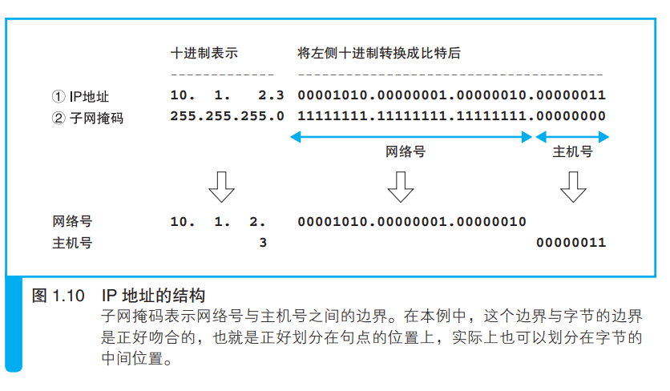
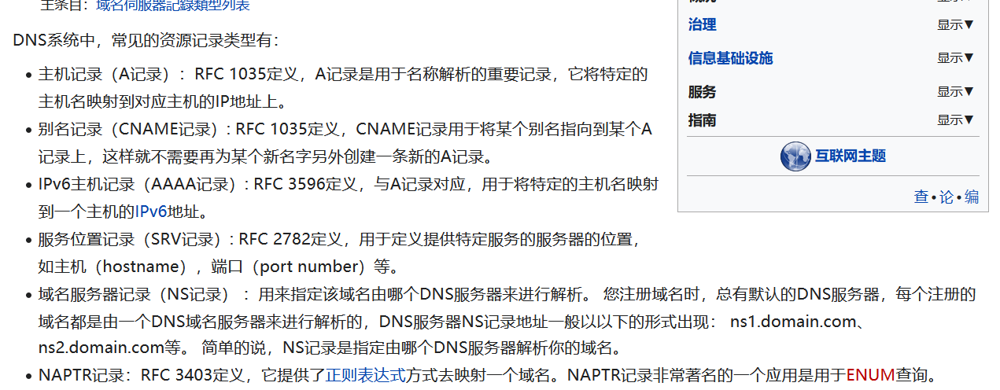

# 1.2 向  DNS 服务器查询 Web 服务器的 IP 地址

## 1.1 IP 地址的基本知识

生成 HTTP 消息之后，接下来我们需要委托操作系统将消息发送给Web 服务器. (发送什么?)

2.  浏览器本身不具备发生消息的功能,需要委托操作系统.
3.  查找网址中的服务器域名对应的 `IP`地址.
4.  再委托操作系统发送消息时，需要提供IP地址(要不然他怎么指定发送给谁？)


第二段 TCP/IP 的基本思路.

1.  TCP/IP思路的基本结构图.(多个子网，通过路由器连接起来的一个大网络)
2.  基本的xx .包括 `路由器` `子网` `计算机` `集线器` .

子网:用集线器连接起来的多台计算机。

集线器的作用把多台计算机的网络连接起来.

集线器跟网线之间的关系。

```
简要描述TCP/IP的基本思路.
里面包括什么?
他们之间的关系.
现实生活中有没有类似的参照物.

```


第三段 `IP`地址的结构与发送消息传输具体过程的简要概述.

1.  -2 在网络中，所有的设备都会被分配一个地址。类似于小区中的几单元几栋。
2.  IP地址的组成。 `网络号` & `主机号`
3.  有了IP地址就可以判断服务器的位置，就能通过操作系统将信息发送到服务器。
4.  消息传输的具体过程。

发送者发出的消息首先经过子网中的集线器 A，转发到距离发送者**最近的**路由器。接下来，路由器会根据消息的目的地判断下一个路由器的位置，然后将消息发送到下一个路由器，即消息再次经过子网内的集线器被转发到下一个路由器。前面的过程不断重复，最终消息就被传送到了目的地。


第四段 IP地址的具体描述

1.  IP地址的实例。`192.168.1.1`

```
一串32 比特的数字，按照 8 比特（1 字节）为一组分成 4 组，分别用十进制表示
然后再用圆点隔开.

```




浏览器无法发生消息给web服务器,而是需要委托计算机

这么做之前,需要知道我把消息发给谁.

类似与 我自己不能去寄信(寄信的距离太远,自己无法去),于是我把委托给邮局,可是邮局并不知道,我需要寄给谁,于是我需要写上我的信息与收件人的信息,来确定我寄给谁.

`IP`的基本结构是什么?.

子网是什么?

TCP/IP的基本思路?


## 1.2 域名和 IP 地址并用的理由

1.  IP地址难以记忆。
2.  域名的字节太多，且不确定，路由器处理起来效率低下。

解决办法:

于是，现在我们使用的方案是让人来使用名称，让路由器来使用 IP 地
址。为了填补两者之间的障碍，需要有一个机制能够通过名称来查询 IP 地
址，或者通过 IP 地址来查询名称，这样就能够在人和机器双方都不做出牺
牲的前提下完美地解决问题。这个机制就是 `DNS`

## 1.3 Socket 库提供查询 IP 地址的功能


 DNS 服务器发出查询，也就是向 DNS 服务器发送查询消息，并接
收服务器返回的响应消息。
DNS 服务器是什么？再哪里？


2:换句话说，对于 DNS 服务器，我们的计算机上
一定有相应的 DNS 客户端，他的作用对DNS进行解析。
通过 DNS 查询 IP 地址的操作称为域名解析，因此
负责执行解析（resolution）这一操作的就叫解析器（resolver）了


3: 介绍解析器。

1.  解释器是一段程序，存放在操作系统的 Socket 库。
2.  介绍计算机中的`库`，与  `Socket 库`。

**库** 库就是一堆通用程序组件的集合，其他的应用程序都需要使用其中的组件

**Socket 库** 其中包含的程序组件可以让其他的应用程序调用操作系统的网络功能 ，而解析器就是这个库中的其中一种程序组件

Socket 库是在加州大学伯克利分校开发的 UNIX 系操作系统 BSD 中开发的 C
语言库，互联网中所使用的大多数功能都是基于 Socket 库来开发的。因此，
BSD 之外的其他操作系统以及 C 语言之外的其他编程语言也参照 Socket 库开
发了相应的网络库。可以说，Socket 库是网络开发中的一种标准库

3.  库的好处。


总结:

解析器只是库中的一个模块而已。

DNS 域名服务系统。将服务器名称和 IP 地址进行关联是 DNS 最常见的用法

## 1.4 通过解析器向 DNS 服务器发出查询

未看

## 1.5 解析器的内部原理

# 1.3 DNS 服务器的基本工作

DNS 服务器的基本工作就是接收来自客户端的**查询消息**，然后根据消息的内容**返回响应**

这跟浏览器向服务器发送请求非常相似。


查询消息的组成

1.  域名
2.  Class 只需要记住 是IN就可以了 
3.  记录类型 对于不同的记录类型，服务器向客户端返回的信息也会不同



暂时理解不了。(记录)


