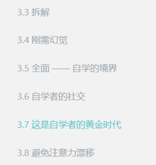
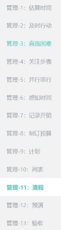
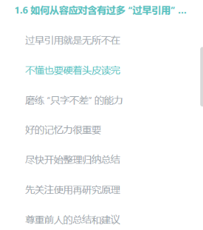
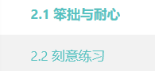

学习全流程。

1.  选择教材
2.  拆解任务
3.  泛化目标(我的理解 学习方式)
4.  阅读策略


## 1. 你需要估算任务的完成时间，在此基础上制定任务列表。

比如你要学习数学。

选什么样的书，什么样的教程，不懂这个领域的你，最好的方法就是问大牛。

## 2. 拆解任务

2. 再做一项任务之前，把任务进行拆解，分析，拆成独立的子问题。耦合不能过重
  然后根据子问题，规划具体的步骤。
  然后开始进行。


这里才开始进行学习。
根据不同的学科，采用不同的策略。

## 3. 阅读策略，学习方法

3. 根据如何从容应对过早引用提到的阅读策略。进行学习。

学习全流程。


##  4. 注意事项

再整个学习过程中你需要注意的问题包括。

### 1. 避免注意漂移


## 5. 记录 复盘，不断修正优化，整个学习流程


4. 完成任务后你需要记录开销，复盘，不断修正优化，整个学习流程。


```
把你每次学习csapp的过程记录下来。
写成一个，自学 
```


## 6. 验收机制


4. 你还需要有一个验收机制，来检验你是否真正搞懂了。

   

5. 自己出题。

6. 做题目。

7. 提出正确的问题，并回答。

8. 写教程

9. 费曼学习法。给别人讲清楚。


## 7. 不断完善

刻意思考是哪个部分呢？

用，练完就刻意用了，用完就开始造。
这就是为什么他说需要做项目的原因，你需要用，甚至你需要自己造东西。自己完成的作品。

反思。
自己的思考过程(路径)也就是复盘。
什么是反思。










