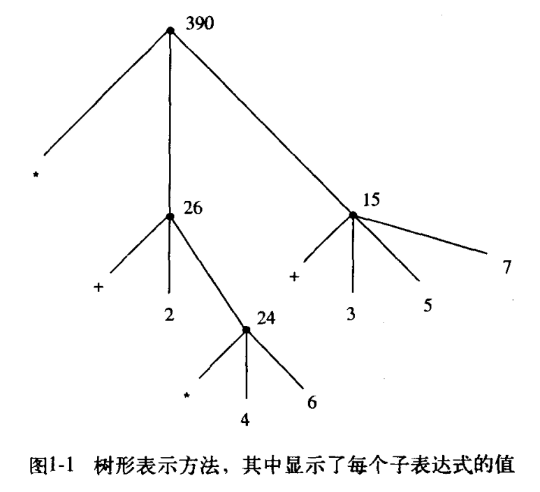
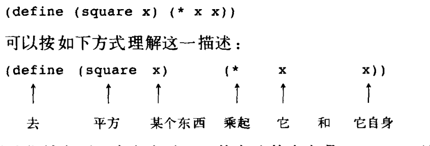

## 构造过程抽象

重要概念: 计算过程


程序设计。


什么是过程性的思想


## 1.1 程序设计的基本元素

基本表达形式


过程是关于操作这些数据的  规则的描述。

也就是说，他是一些规则。


过程构造的则方面。

### 1.2 命名和环境

变量与值

```
define 是 我 们 所 用 的 语言 里 最 简单 的 抽象 方法 ， 它 允许 我 们 用 一 个 简单 的 名 字 去 引用 一 个 组 合 运算 的 结果 ， 例 如 上 面 算出 的 circumference。 一 般 而 言 ， 计 算得 到 的 对 象 完全 可 以 具有 非常 复杂 的 结构 ， 如 果 每 次 需要 使 用 它们 时 ， 都 必须 记 住 并 重复 地 写 出 它们 的 细节 ，那 将 是 极端 不 方便 的 事情 。 实 际 上 ，构 造 一 个 复杂 的 程序 ， 也 就 是 为 了 去 一 步 步 地 创建 出 越 来 越 复杂 的 计算 性 对 象 。 解 释 器 使 这 种 逐步 的 程序 构造 过 程 变 得 非常 方便 ， 因 为 我 们 可 以 通 过 一 系列 交互 式 动作 ， 逐 步 创 建 起 所 需要 的 名 字 - 对 象 关 联 。 这 种 特征 鼓励 人 们 采用 递增 的 方式 去 开发 和 调试 程序 。 在 很 大 程度 上 ， 这 一 情况 也 出 于 另 一 个 事实 ， 那 就 是 ， 一 个 Lisp 程 序 通常 总 是 由 一 大 批 相 对 简单 的 过 程 组 成 的 。
```

变量其实就是编程语言中最简单的抽象方法。

为什么？


重要概念

这种存储被称为环境。

### 1.3 组合式的求值

什么是过程性思维有关的各种问题。隔离出来。


什么是组合式。

例子

```lisp
(* (+ 2 (* 4 6))
 (+ 3 5 7))

```


把各个子表达式组合起来就是组合式。


树形结构 与递归之间的关系。


#### 组合式类比为树




### 1.4 复合过程

**过程定义** 是一种抽象手段。



#### 例子

```
(define (square x) (* x x))

这就是函数。

进一步抽象。square过程本身作为构件，进一步去构造更复杂的过程。

比如: 构成一个 x的平方 + y的平方


```


## 1.5 过程应用的替代模型

### 例子


```scheme
两层的函数嵌套。

(define (square x) (* x x))
与python js一样 
define词 函数名与参数  函数体


(define (sum-of-squares x y)
  (+ (square x) (square y)))

;: (sum-of-squares 3 4)

(define (f a)
  (sum-of-squares (+ a 1) (* a 2)))

(f 5)

( + (square 6 * 6)  (square 10 * 10) )
( + 36 100)

()


(define (f a)
  (sum-of-squares (+ a 1) (* a 2)))

(f 5)

;;;SECTION 1.1.5

;: (f 5)
;: (sum-of-squares (+ 5 1) (* 5 2))
;: (+ (square 6) (square 10))
;: (+ (* 6 6) (* 10 10))
;: (+ 36 100)
完全展开而后归约的求值模型称为 正则序求值。


;: (f 5)
;: (sum-of-squares (+ 5 1) (* 5 2))
;: (+    (square (+ 5 1))      (square (* 5 2))  )
;: (+    (* (+ 5 1) (+ 5 1))   (* (* 5 2) (* 5 2)))
;: (+         (* 6 6)             (* 10 10))
;: (+           36                   100)
;:                     136
应用序 求值
这种计算过程称为过程应用的代换模型。
就是把抽象的字母。 替换成 具体的参数。
```


### 试着模仿

看见这个例子。我就想到了快编程布置的作业。

非常相似。就是多个构造的小组件。组装起来的成为一个灵活的程序。
