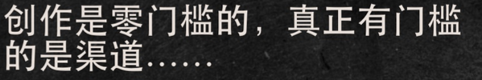

## 回顾


上一节课本质上来看是给各位同学开眼开脑的。有个比较有趣的现象，一般来说那些小时候学画画的，后来竟然可以考进艺术学院的人，在入学的时候，基础作画技艺都已经相当不错了，可是到了艺术学院他们还是要去上课，有大师们给他们讲课，那么那些大师们在课堂上究竟讲什么教什么呢？

那些绘画大师们在课堂上教的主要内容和李笑来在现在的写作课上传递的主要内容是一样的，基本上都不是关于所谓基础技能的，都是关于开业或者开脑的，艺术是关于美学的，所以大师们要解决的问题是大家都会画画，都有几乎同样的基础技能。

就好像我想写宋柯大家都会写字都会造句，可问题在于说画画美究竟是什么？美在哪里？再进一步大家会惊讶的发现美这个东西其实是无所不在的，远在天边近在眼前。

那么下一个问题就发现了如何发现所以呢上一节课的内容就是这样的，明明我们头顶着同样的蓝天脚，踏着同样的大地，我们同样呼吸着同样的空气，可我们感知到的就是完全不一样的世界，为什么？因为你对底层架构的感知不同，我们应该如何改变，知道哪里不同，就是你能够迈出的第一步，迈出这一步之后，你能去向何方？我其实是没有办法知道的，你现在自己也是没有办法知道的，也可能不知道。

但终究有一天只要你一直在走，那么你就会走出一条属于你自己的路.进入一个属于你自己的不一样的世界，甚至干脆是你自己通过努力，通过持续创造出来的一个新的世界。


上一节课的作业非常重要，只要你的确在不断的做作业，你就一定会发生巨大的变化，它不是一点一点的变化，那变化是你几乎从一开始就能够深刻体会的变化，只是别人看不到而已。让我告诉你一个小秘密，如果你身上有别人看不到的变化，甚至别人看不到的优势，那么你的自信力会不由自主的逐步提升，这就好像你在行走江湖的时候深藏暗器，身怀绝技，所以比较自信是一模一样的。

上一节课的作业里让大家画名词画形容词，我没有留作业说要画副词和动词其实原理是一样的，不都是感知吗？你可以把副词和动词的标记加入到上一周的作业再试试。


## 2. 创作门槛

### 1. 零门槛

看来让我们进入第一个话题，这节课的标题是一切创作的前提都是选择。首先让我们来看看创作的门槛到底高还是高，你问问你自己这个问题创作的门槛高吗？很高吗？这时刻绝大多数人都误会了很久的问题，甚至误解了一辈子的问题，绝大多数人都会觉得说创作的门槛还是相当高的，并且只要你去问那些真正的创作者，得到的答案也总是一样的，创作是有门槛的，并且门槛还是相当高的。

更为有趣的是无论干什么，伪专家总是比真专家多至少10倍。这学校里的作文老师基本上都是伪专家，自己没写过什么像样的文章能够被发表，并且获得大量的认可，更不用提能够出版书籍了，但他们的title真的就是作文老师，甚至比作文老师更为高级，教语文老师。

有一个段子说如果你能做，那么你就去做，如果你做不了，那么你就去当老师去教。这是我见过的黑老师最狠的一个说法，这究竟是谁说的？著名的剧作家萧伯纳。当然了胶不是最差的，这个段子后面还有后记说如果你能做那么你就去做，如果你做不了，那么你就当老师去教，如果连教都教不了，你就可以去当评论家。这肖伯纳也是个人才你知道吧？当年著名的演员邓肯女神给他写情书，说你看我有最美丽的身体，你有最聪明的脑子，我们一起生个孩子肯定特别棒。

结果小宝纳回心说，万一生出来的孩子身体像我脑子里，那岂不是很糟糕，这就是孝关娜对吧？有些人可能不知道肖国亮是谁，花女就是他的作品，然后圣女贞德魔鬼的门徒都是他的作品，1925年度的诺贝尔文学奖获得者。

如果你要是问那些伪专家，包括老师包括评论家，那么会得到的是更为吓人的答复，他们会告诉你说创作不仅门槛高门槛，甚至还是干脆逾越不了的，因为他们会告诉你说创造创作需要天赋，真正的专家虽然会以错误地告诉你创作这事儿是有门槛的，但他不是故意骗你，而是他误会了。

所以他们会同样真诚的告诉你天赋非常重要，在这件事上他们不仅真诚，并且真的没有任何误解。

伪专家们为什么会强调天赋？因为天赋是玄学，所以可以用来当做挡箭牌，当做遮羞布去这样一些尴尬。

比如说自己是平庸的，自己其实是没有作品的等等，不用天赋这个说法，他们就没有办法继续冒充专家了，你说是不是？

现在你已经听出来了，创作的事根本就不需要天赋，并且更为重要的是创作的门槛不仅根本就不高，甚至创作这事原本完全就没有任何门槛，零门槛到什么程度，当然是创作这事完全是只要你愿意可以的事情，只要你愿意，为什么一直以来，哪怕是那些真正的专家都会误以为创作的是有，门槛的呢？他们误会了而已，真正有门槛的真正门槛高的根本不是创作，而是另外一个东西。

### 1.2 发行渠道


真正的门槛在于`发行渠道`，现在大家熟悉的一个名词叫做网红，这已经是非常具体的名词了，对绝大多数人来说网红这个词不大可能是抽象名词了，你知道吗？在没有网的时代也有红人而且更红，今天的网城都想象不到的红。

李孝来1972年出生，在我长大之后开始上学，读书的过程当中，全国上下大江南北，几乎人人都买过一个四川人的书，这个人就是红人非常红，这人的名字叫唐中华，到今天都有可能有人买过他的钢笔字帖，人家不仅红，并且营销也很厉害，在报纸上编了无数的瞎话，比如说某人因为写字太漂亮，所以被首长看上做了首长的秘书什么的，这个其实明显是瞎话吗？

这就好像嫁给王子当然要漂亮，那漂亮肯定是其中的一个因素，不会因为漂亮就肯定能够当上王子的对吧？

所以你当个什么首长的秘书写字漂亮当然是其中的一个因素对吧？但是肯定不只是这一个因素，这个才能够当上这个就能够当上首长的秘书对不对？明显是瞎话，但这不重要，人家不仅红营销也厉害，对吧？不仅营销厉害，还可以直接带的货厉害，你可能无法想象的。

1980年庞中华出版了一本谈谈学写钢笔字，第一版手印就是20万车，定价0.70元，也就是7毛钱，在接下来的十年之中，整个80年代这本7毛钱的书总计正版卖出了1000多万车，销售额突破700万元。700万元你要知道那还是在一斤猪肉一块钱不到的时代，7000元人民币其实是可以买一套房的时代。按收入的实际购买能力计算的话，别说李笑来通过写书赚到的钱了，就算是现在的网红薇娅、李佳琦啥的都根本不可能买到赚到那么多的钱。

可实际上真正的门槛并不在于写字是否漂亮，并不在于是写毛笔字漂亮还是写钢笔字漂亮，因为在同一个时期能够写出一手漂亮字的人实际上非常多，无论是毛笔字还是钢铁丝，比如受唐中华的启发，另外一个叫做司马宴的湖北人，用两天时间写好了一本书，拿到了一笔稿费，上面提到的7000元能买一套房子，说的就是他。

紧接着他又花了一周的时间信号，第二本磁铁转眼在武汉又给他妈妈买了另外一套房子，你看真正的门槛在于渠道，那个时候全国上下的出版社就没多少，并且全部是国营能够让出版社出版你的字帖或者书籍，超乎想象的困难。你可能写字比彭楚华司马懿更好看更厉害，当然你就是搞不定出版社，于是红也好火也罢，跟你一毛钱关系都没有，比如说一毛钱关系一分钱关系都没有。


## 2. 后去中心化时代


所谓的去中心化是网络结构拓扑学的一个术语，为什么标题里会有一个后字呢？对不对？去中心化试试已经完成了，所以现在是后续中心化式的去中心化的意思并不是消灭所有的中心，而是当初我一起最大的中心，最终逐步被多个相对小的中心所替代。

你看以前全国上下就一个中央电视台，并且还是唯一且最大的中心，现在各个省各个市都有电视台，并且收视率不一定比央视比，比如湖南卫视，于是网络结构从中心化结构一路去中心化变成了分布式结构。所以你看以前全国上下就那么几个大报纸，人民日报参考消息，然后后来就有很多种报纸杂志出版社也一样，也被去中心化变成分布式网络结构了。

### 1. 渠道成本降低到几近为零

再后来互联网出现了互联网流行了，最终互联网吞噬了整个世界。2005年李娇来开始写博客的时候，就已经开始可以百%自出版，自己就可以出版了，用不着任何出版社，用不着任何审批，写完之后就可以直接发表在互联网上，仅仅是花了一两天时间学习如何买个虚拟服务器，如何搭建一个word press，包括程序而已，这下可好，渠道成本降低为0。

到了2011年前后推特开始流行起来，不仅渠道成本降低了，连写作能力门槛都降低了，你不用长篇大论了，想长篇大论也不行，只给你了1百四十字的空间，很少有人重视这样的变化，包括当初的李笑来，结果大量的平民创作者出现了，因为完全没有门槛，你不用自己建站，只需要免费注册，不要上李校来的写作课，只需要最多写140字。

在这样的底层逻辑彻底颠覆的情况下，既得利益者常常是无所适从的。在博客时代里如鱼得水的文字工作者，面对140的140字的空间，完全是不知所措的，甚至干脆没办法理解它的意义。

而另外更大比例的在过去并不认为自己是合格创作者的人们，别人也不认为他们是合格创作者，迅速的找到了自己的位置，哪怕四处搬运段子都能做出来一个大号，把自己变成了渠道，你还记得吗？曾经渠道才是创作者的最大门槛，结果又一次非创作者们占领了渠道，你别觉得冤，你也别觉得冤，这事只能怪你自己怪啥？怪你自己，作为一个创作者竟然从来没有穿过表象，看透实质的高阶思维能力，你没看出来真正有门槛的是渠道，这是怪谁怪你自己吗？怪你自己没有。怪你自己怪你自己，没有穿过表象看透实质的能力，你想想看是不是这个道理？

让我们现在再来看你的发表渠道到底有没有格外丰富。我们先看看微博，在微博上你不仅可以发表140字，甚至更承诺一搏，也可以发表完整的文章叫做微博头条。

我们再去看看微信，在微信上你可以免费注册申请微信公众账号订阅号，然后每天可以发表一篇文章，并且可以插入图片、音频甚至视频，这是微信上还有另外一个发表渠道，你可能一直没有正式微信朋友圈，其实它没有字数限制，并且还可以添加任意链接。

除了文字创作之外，还有很多其他创作渠道，比如摄影创作，你可以把它发表在国外的Instagram，或者是国内的微信朋友圈或者是微博。音乐创作可以发布在国外的spot five，也可以发布在国内的各种平台，视频创作短视频创作可以发表在微博，也可以发表在抖音、快手b站等等。

然后现在还有微信视频号，这些都是你的发表渠道，前提是只要你肯创作，那么总是有人能够看到总是可以得到法，可事实上绝大多数人，包括你们当中的绝大多数人，从来都没有认真对待过这些渠道，这些宝贵的渠道，这些事实上你们早就应该认真经营的渠道之后，至于至于如何建立渠道，怎么利用好这些渠道，肯定不是写作课的内容，但我也设计了另外一个通路，让大家有迹可循。先别着急。话说回来，刚刚我们改变了一个认知，并且这个认知实在是太重要了，什么创作是零门槛的，真正有门槛的是渠道。

现在你也看到了，你事实上在过去的相当长一段时间里，一直在浪费自己原本可以用起来的渠道，你遭遇到的门槛是你自己建立起来的，这太尴尬。你现在知道了比起写什么怎么写，这两个让你头痛不已的核心问题来说，还有更为深层次的问题和障碍需要解决。那个问题虽然创作是0门槛的，可是你的观众或者你的听众或者你的读者究竟在哪里？最可怜的创作者不是那种没有作品的创作者，没有作品你说可怜什么吗？而是有作品，但没有观众有作品，但没有听众有作品，但没有读者，或者通称为没有受众的创作者，没有受众的创作者最可怜。

即便有很多的受众创作者，还要面对究竟有多少比例的人认可的问题，可是完全没有受众，连最基本的认可都谈不上，压根就不存在。

你说这样的创作者可不可怜虽然，今天在这个课堂上我没有时间也不可能专门去讲解如何建立你的渠道，但是仅仅这个认知的改变就已经够颠覆你的了。从此之后你再也不可能像以前那样随便发朋友圈了，随便发微博了，再也不可能像以前那样不重视微信公众账号了，当然也不会再像以前那样完全不在意，或者也不知道应该如何在意自己你的版权了。

你要明白的是这个时代在渠道这件事上给每个普通人都做了巨大的赋能，只不过绝大多数人真的完全没有感知而已。最关键的差异出现在你的认知上。

### 2. 结论


过去你认为创作是有门槛的，而不知道真正的门槛在渠道上，所以你做事的顺序是不一样的。过去你会误以为你得先学会写作，先学会创作，然后才能做其他的事情。现在我把你的认知感知调整过来了，你就明白你原来做反了做错了，为什么？因为事实上在后续中心化的时代里，就算没有创作能力，也可以建设渠道，只是没有人像李笑来这样认真提醒你而已。

比如我就知道一个高手在微博上花了两年做了个段子号对吧？4处搬运捞了500万粉丝，然后删掉所有的微博改名，摇身一变开始做自己真正想做的事情。 科普博主


## 3. 究竟写什么？

### 1. 童话大王 郑渊洁

第一个我要跟大家讲的是讲道理不如讲故事，所以我先给大家讲一个真实的故事，1955年的时候有个小朋友出生了，出生在河北石家庄，这小孩上小学的时候太淘气了，所以后来就被开除了，小学没毕业就开除了，咋淘气了？

老师让大家写作文，命题作文说早起的鸟儿有虫使，结果第二天这孩子叫上去，叫上去这样一天说早起的虫子被鸟翅，别说他们把老师气坏了，全体老师都气坏了，于是他就只好被开除了可是这孩子爸也是厉害，根本就没有责骂自己的孩子，反倒是平平淡淡的说了一句，没事小子你爸爸回家我自己教你，古今中外都有这样的父母的，当年爱迪生在小学一年就被劝退，爱迪生的妈妈也是这么说，的啊it's okay，i'll teach you myself。

后来小学都没毕业了的孩子照样长大了，参军服役了，退役之后去了厂子里当了工人，可是他不甘心怎么办？他觉得自己能写字赚钱一定没有问题，可问题是写什么？他就想这个讲故事肯定比讲道理赚钱，为什么？因为听故事的人比听道理的人多，所以要写故事，可是写什么故事呢？他爸曾经是军校的教师，后来因为政治问题丢了工作，所以他知道的绝对不能写任何可能与政治扯上关系的故事，但还是想不明白自己到底写啥好。

于是就天天去新华书店，一一本书得翻翻了，两三个月突然想明白了可以写童话，因为写童话的人很少，更重要的是这写通话是不可能犯政治错误的，当然了更重要的是这写通话多简单，随便哪个科学知识点就可以至少编一个故事，每个故事不用写太长，也不应该写太长，因为是给孩子看的最为关键的是不需要使用大量的修辞，大白话就可以搞定，需要的只是另外一个0成本的东西，叫做想象力和创造力。

从小就可以把老师留的作文反过来写的人最不缺的就是想象力和创造，然后他就开始写，不停的写一口气写了40年，现在还在写，这些年来他用稿费在北京买了一套又一套的房子，也不装修就放在那里，房子贵，也没空着放什么放满了读者来信，估计你也听出来了，1995年出生的写了一辈子童话的人是你们都熟悉的作者，童话大王郑元杰李笑来的人生第一本书就是他的叫做皮皮鲁与鲁西西，我和他曾经是邻居，因为我在北京朝阳区华贸公寓附近住过一段时间，有一次我终于有机会请我的偶像郑元杰吃饭，我对他说我跟你一样，现在花的每一分钱都是稿费的税后收入，故事讲完了，那么对我们有什么启发？

### 1.2 写什么远比怎么写重要一万倍

今天之前就在刚刚我们改变了一个认知创作其实没有门槛，但渠道的门槛很高，那么如果你有能力建设渠道或者获得渠道的时候，接下来写什么与怎么写之间哪个更重要呢？现在结论来了，这个结论就是写什么远比怎么写重要1万倍。

几年前我在饭桌上听郑云志老师讲，他当年的决策过程真的是冒了一身冷汗，因为我当时能够感知到相对于他后面真的写了三十几年这个事实来看，显然更具价值的是他三十几年前的选择，或者被称为决策是什么？写钝化。当时我坐在那里，他也坐在我对面，就那么轻描淡写的说讲道理肯定不如讲故事赚钱。然后我就那么震惊的发现自己当年开始写作的时候，竟然从来没有想过比较当场甘拜下动，你先来写什么的？

刚开始写教辅书籍，托福核心词汇，21天托福IB t高分作文，后来写把时间当做朋友，再后来写通往财富自由之路，韭菜的自我修养自学是门手艺定投改变命运，以及最近刚刚写完的微信互联网平民创业以及现在的写作课。

话说这要不是李笑来不小心在投资上赚了很多钱，那么李笑来可能早就不再写讲道理的书了，甚至干脆不写了，忙着赚钱吗？

或者写也要去写故事，写剧本是讲故事的经济效益肯定比讲道理的经济效益高。事实上2010年到2015年这个期间，我也在写东西，还是每天3000字，但基本没有发表过，为什么？首先的确是在忙着赚钱，其次呢写的都是故事，就是在学习如何写故事，我一直在想你真的跟自己的老婆这么认真的讲过，若是有一天我竟然没有赚到钱，最后还有两个选择，一个是去当神父，这事我能干也能干得很好。

当然了还有另外一个不那么艰难的选择，就是开始认真写故事。

### 1.3 注意注意(思维固化)

留下来的确是认真的在这里认真提醒一下在座各位同学，大家不能因为上了李笑来的写作课，最终就被李笑来的做法限制了，很多人看你上来写时间管理，个人成长，财富自由，然后也就开始写这些东西，首先写这些东西你可能的确拼不过我，但其实更为重要的是写这种东西的经济效益可能起码肯定不像你想象的那么好，学生最容易被老师所局限，因为很多人会混淆学习和模仿之间的巨大差别，人家拿来一大块白色画布，然后在某处点那个点，然后就变成了经典，为什么你一看觉得自己也会，于是你也找了一块白色画布，然后在同样地方画了一个同样的点，但你的所谓作品卖不出去，是绝对卖不出去的，因为人家是第一个用这种方式展现解约主义的，所以有价值你不是第一个你也没有展现任何东西，所以你就就没有价值，这就解释了为什么创造和模仿之间有着巨大的差别。

再比如说当微信视频号这个机会出现的时候，李笑来也开通了微信视频号，然后经过一小段时间的摸索，李笑来选择了不出镜，用录音加翻转字幕的方式制作内容，于是很多人也跟着这么做，这是东施效颦，李笑来这么做是有原因的，首先李笑来的受众已经积累了很多年，所以李笑来讲道理熬鸡汤真的有很多人喜欢。

其次，我其实是从制作成本的角度出发做这个决策，你只看到了表面，你不明白这种选择背后的机理和决策过程，然后你依葫芦画瓢那效果肯定不好，是不是？

### 1.4 选择的重要性

所以在这里要重复的格外提醒一下，估计你可能在很多地方都听说过选择比努力重要，然而为什么你听过这话，无数遍依然对选择不重视，或者我们再问为什么那么多人都听过这个道理，但依然并不重视选择。

这个现象的根源在于人们总是误以为选择是属于当下的，可事实上选择是属于未来，请你仔细理解这句话。重要的选择都是属于关于未来的。也就是说一旦你做了选择，就意味着说因为你选择你的生命里有相当长一段时间，甚至气候全部都会因为选择而发生变化。

### 2. 讲道理的原则

新认知

加深旧认知

新奇特

那么接下来再讨论话说回来，就算你非要像李笑来一样执着于写假道理的文字应该如何选择呢？应该按照什么样的标准去衡量自己的决策，我曾经不止在一个场合里分享过，有一个特别简单的衡量标准，

那就是你写的东西到底对别人有没有用。我当时写把时间当做朋友的时候，就是按照这个标准对到底写什么进行了筛选。不仅如此，我的要求实际上更高一些，因为我是这么要求自己的，但不简单的是我写的东西到底对别人有没有用，而是我写的这些东西在10年后是否依然对读者有用。

所以李霄来写的书不仅是畅销书，更是畅销书。

2019年李笑来在写定投改变命运的时候要求就更高了，是我写的这些东西在30年后是否依然对读者有，这些都是你们已经知道的，已经听我讲过的，那有没有我没有跟你们讲过的，告诉你两个字，这两个字是未知，为什么？人家会觉得你写的东西你讲的东西有用，如果你不写，如果你不说你就不知道，

这叫为大家**添加新的认知**。

他们国内商业圈经常使用词汇，这算是做增量市场，而不是在存量市场里下折腾，请大家衡量一下，那么自己琢磨一下，评价一下上节课的内容是不是你没想到我会那么讲，或者说干脆是你原来不知道的，再给大家举个例子，我曾写过如何写好英文比较句，这是我当年在新东方讲课的时候，一节课几乎150分钟的内容的大纲，因为在实际讲解当中会加入更多的举一反三的例子和说明，你可以仔细去看，请你再回顾一下这一次课到目前为止的内容是不是也一样，如果我不费劲周折提醒你的话，你是不是会觉得同样误以为创作是有门槛的，你是不是会依然忽视渠道的的意义和渠道的建设，你是不是一直以来误以为选择是属于当下的？

选择是关于当下的，这就是你们在听课的过程当中觉得有用，觉得值当的根本原因，因为你得到了你原本没有感知到的感知和认知，就这么简单。

所以某种意义上哪怕是讲故事，这两个字也同样适用，**讲故事讲究新奇特**，这三个字你仔细研究一下，就会发现都是关于未知的，之所以是新的，那就是因为之前没有见过，所以才是新的，即未知之所以是奇怪的，就是因为平常见不到即未知，之所以是特别的还是因为未知，如果你用这个标准去要求资金，就会发现模仿跟风跟你真的完全没有关系。我知道你也看出来了，这不是所有人的选择，最终这肯定是少数人的选择，但请你相信我只有这样极致的标准要求自己，你才有可能真正有出息，否则就算能够热闹一时，也早晚泯然众人矣。

当然了，刚刚起步的你自己还在爬坡的过程当中，哪有那么多的时间精力，更重要是哪有那么多强的能力，那么强的能力去提供大家不知道的认知，有没有什么办法可以边进步边练习的窍门，有没有什么办法做到砍柴不误磨刀功能？当然是肯定的，因为在未知原则这个前提下，原则下向受众提供价值的方法，除了添加新的人之外，还有另外一个叫做加深理解已有的认知，**加深理解已有的认知**。


写一些别人知道的，但忘记了的。


### 1.5 起步 教程

理论上所有的教科书都是主要专攻添加新认知的，所有的教辅书籍都是加深理解已有的认知的。

事实上你早就见过很多这两种书籍，现在也很容易理解这两种书籍的区别，所以告诉大家一个快速入门的秘籍，最快最容易上手的创作其实是做教程，其实是做教程，因为任何事的教程都可以，最基础的无非就是how，再高级一点就是why，当然最高级的是what？

不知道大家是否知道这个网站叫vt，好，它就是教程网站，一个人花了5万美金找了个外包开始起步的网站，现在它的流量是全球排位在前10的网站，对吧？为什么？教程它就是有需求的，好的教程就是层出不穷的，今天作业来了，再一次它不是一天的作业，它不是一周的作业，是第二节课的作业可能需要做很久。


## 4. 作业

### 1. 

首先你仔细回忆一下，在你这么久的人生当中，你遇到过的最好教程是什么？

### 2. 

第二，你需要的教程别人写的好不好，就是当你需要什么东西时候你去找教程，每天都要评判这个教程好，这个教程为什么不好，然后你还要自己评判说如果我自己写我能写成什么样子.

```
评判教程的好坏。哪里好，哪里不好。
如果是我，我会怎么写？
```

### 3. 

开始动手写100篇教程，什么时候写完100篇好的教程，你什么算时候算作业做的差不多了。

### 4. 

第五就是不停的收集反馈，反复揣摩修改你的教程。在写作训练营第一期的时候，李笑来做了一件前无古人后无来者的事情，就是在讲一期写作课的过程当中，直播一本书的创作写作过程。现在这本书已经交由果麦文化出版，说明是微信互联网平民创业，上面的链接就是这本书的开源版本。

在今天的这节课中我们提到一个重点是渠道很重要，关于渠道的更多内容，我们在写作课上是没有办法全面展开深入的，时间不够，但是在这本微信互联网平民创业之中随处可见，如何创建渠道，如何维护渠道的方法论，请大家认真阅读，认真揣摩。





