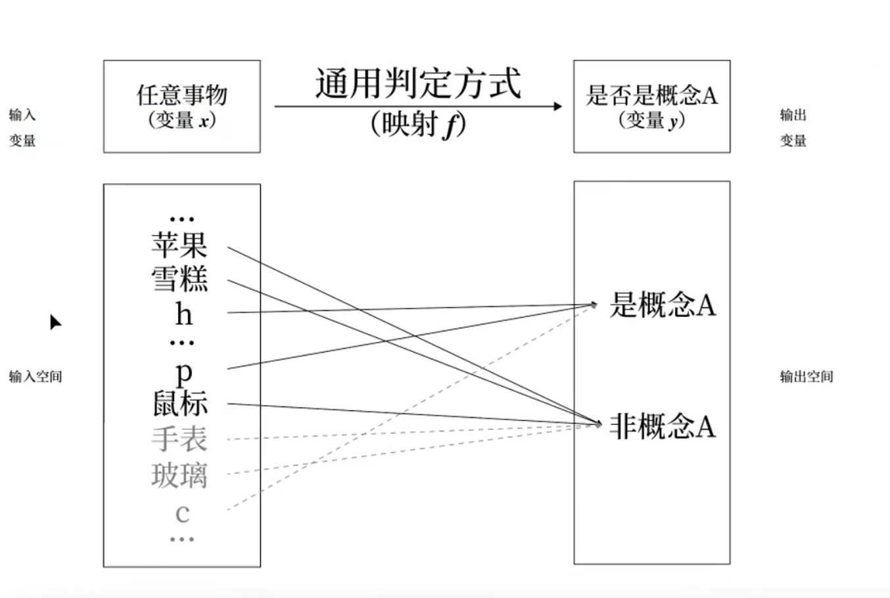
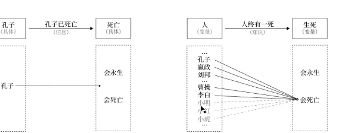
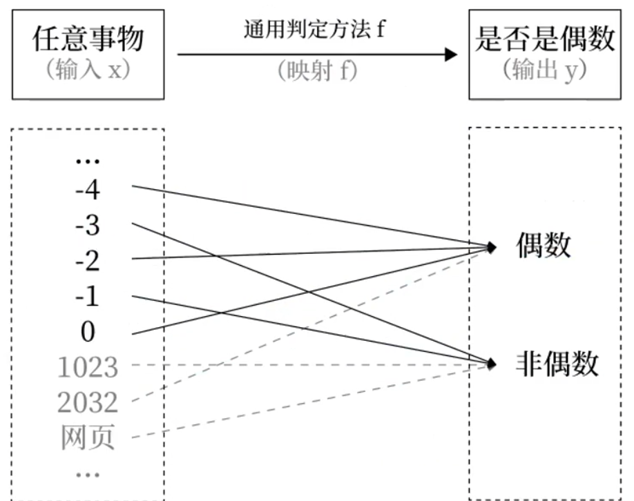

* 输入与输入空间的区别（建模思维）

* 什么是概念知识（「什么是什么」的知识）

* 如何区分【普通描述】和【定义】

## 流程

* 【概念学习实操】流程
    * 寻找概念知识的材料
    * 拆分材料
        * 找出输入和输出
        * 区分核心知识点、周边知识点、以及各自的名称、描述、例子、迁移
    * 理解材料
    * 验证新例&表述转换
        * 判断生活中任意的某个事物，【是】或【不是】这个概念
        * 举出正例（是），举出反例（不是）

* 【材料标签】写法

* 【段落关联】写法

## 内容

### 先说一下之前人问到的一个输入和输入空间之间的区别。

输入是变量，指代一个。

输入空间，是一个集合。

这块我们是用的数学建模的思维的，实际上就是数学当中的集合变量，然后映射等概念放到了自然语言中。因为数学它也是一种语言，它也是帮助你建构模型，描述世界关系的一个语言，符号系统，它和自然语言是可以相对应在一起的。那自然语言当中有一些不规范的，到了数学语言之后，它会非常的规整。那个我们在学习知识的时候都是两类事物之间的关系。那第一类当我们说任意一个事物的时候，我们指的是这个是一个变量，是，然后由这个你这块应该怎么描述？我举个例子去换一个例子。
你比如说当我说整数的时候，我把这个换成整数。他在描述的是一个个一个一个变量，它可以是负四负三二一任何当中的一个。此时我们是会把它说成是输入变量。但如果你想要指代的是整数的整体，他们这个这一个集合这个整体的话，那我们会说它是空间。二者区别就是一个你是指代任意还是指代所有你比如说所有人都会死，这个说法你实际上是在描述输入空间。而当你说任何人都会死的时候，那个任何你描述的实际上是变量。而当你说张三会死，你实际上是在预测把这个变量它变成了个常量。然后你预测张三法外狂徒，他会被警察终将会被警察这个枪毙，这是你的预测。那你说孔子死了，他也是一个常量，那这个是过去发生的事实，所以一个是变量，一个是集合。为什么我们称它为空间呢？是因为这个空间它会带有一定的物理属性。你会发现数学语言当中它会它描述这个东西的词和物理当中描述的词不太一样。比如说我们有时候会用函数和映射来描述这个 F 但是在那个乌当它含有物理属性的时候，我们会把用模型来描述这个整个这个整体，就用模型来描述它整体。然后它虽然是个集合，那但它有了一些特定的物理属性之后，它有是一些特制之后，我们就把那个一个比较特殊的集合称为空间。总之你就想它是一个有物理属性的，我们赋予了它一些物理意义。
1

### 什么是概念知识？

概念知识也是最简单的一个知识。我们在岸霞的这个故事当中，就第一个学到的知识虽然我没讲，但你其实第一个学到的知识是什么？是暗想，就是那一类乌漆巴黑的，你根本就看不懂它是啥东西的。这个东西和那个外界这里和那个外界大石块，你看它会有明显的区分。这个东西给他你看了好几个，然后你抓取出来什么是什么？它是这个概念知识你抓取出来了一个概念，抽象出来了一个叫做暗匣。你还可以注意到我在讲这个故事的开始最初用的是一个东西，因为此时你还没有给这个概念进行命名，随后你命了个名，那这个命名的概念我们是概念学习。
但是概念知识和有些这个名称还不太一样。
比如说狼牙山五壮士，他这个就不是知识，因为他不是在描述一类事物，他这个任意一类事物他是不是的，它是一个特质特指的这一类就是不是有一个人他的名字叫做小红，那这个他不是知识，因为它不是这种指代就它的输入空间不是一类情况，它的输入空间只是单个东西，那单个东西这个它它虽然也是什么的结构，但它不是一个知识。

# 概念学习流程

### 1. 找出输入 输出

知识永远是可以让你判断你没见过的东西是不是也是这个概念。所以你今天要去找的知识，就专门找这种知识，什么是什么的知识。然后这里面我就告诉你要这个怎么拆分它的材料。你首先是要就实操步骤了，你先去找概念知识的材料，比如说外部性什么材料都行，你找书上也行，词条也行，反正你就找。然后下一步你把这个材料进行，拆分有一些规则，你首先要找出来它的输入和输出，因为学习官不断在描述输入和输出，大部分人都判断不出来，所以你得我得训练，你不断地去找他的输入和输出是什么。然后你可以这个就先删了，就找他的这个材料当中的核心知识点，你想要学习外部型的话，那核心支点肯定是外部型。
2
随后你把这些材料拆成这几种这个段落，它是描述名称的，是对这个知识点的概括性描述，还是对这个知识点的例子还是类比对比这个类比对比统称迁移，然后你就去理解这个材料。最后你在自己生成一遍新的例子，你生成新的描述，生的生成新的例子，生成新的类比。如果你比较喜欢命名的话，你也可以给它起一个新名字，就是这事是别人的材料。然后当你吸收理解了之后，你要生成自己的材料作业就是这个东西。那核心就在于这块儿你怎么拆分了？我拿这个外部性举例子。
我先不先拿这个先在概念上面讲一个。任何概念知识。
它的输入。如果我们按照变量来输入空间来看的话。
它就是由世间万物任何一任意事物就所有事物世间万物所有事物所组成的集合空间。我们它是这个概念的输入空间，那它的输如果用变量来描述的话，那就是任意事物，它的输你的输入是任意事物输出就是判断它是这个概念还是不是这个概念。它是由两类情况所组成的一个集合，两类情况所组成的一个空间。这种概念性知识它的空间全部它的输出全是这种样子的，而它的输入也全部都是这个都非常固定，它的输入输出非常固定。比如说偶数它的输入空间就给你任何一个失误。
让你来判断它是偶数还是不是偶数。这里面负 4 那它是偶数，负 3 它不是偶数这个是它的输出空间，是由两个情况所组成的集合。

## 1.1 两个误区

### 1. 切莫背知识的描述

### 1.1 知识的名字

知识的名字只是为了方便与人进行交流。

你要做的，是通过多个具体例子，来理解这段描述。进入验证自己是否理解了描述。

你所学习的东西，就这个判定法则，你学的东西不是这个，你不要去背这个东西，它是对你的这个判定法则的一种描述，一种直接性的描述，它是帮助你在大脑当中建构这个通用规则的。然后你也不要去背这个描述的，名字它只是一个，因为你不能每一次都把这么一大段全给说出来，它是一个关键词指代，是为了方便你交流用的。所以这两个误区一定要避免。
你不要去背知识的描述，也不要去背知识的名字。当然你后面你会需要记忆知识的名字，这个等你建构完这个概念之后再说这块，你已经看到它可以有几种材料，首先是知识的名字关键词。我们看这个材料当中这句话外部性，它又称为什么什么什么，所以这句话它完它全部都是在说这个概念，它的别称是什么。
你比如说小明它又叫狗圣，又叫这个学霸反正可能是有些外号一样的名称，这是关于他的名字的这个知识的名字的。名字完了是描述，就是概括性的来讲，这个概念它符合什么样的特中比如说偶数，我们说偶数是能够被 2 所整出的整数，它这个能被 2 整除，就是这个东西的一个特征。
那另一个特征，它还是一个整数，这两个特征合起来它可以，它它就可以这个较为精准的判断它是偶数还是不是偶数。

### 定义 与 普遍描述之间的区别

定义: 一个是比较全面的比较准确

普通描述 【片面的】

如果一段一个描述，它可以非常精准的判断，那么它就是定义了。

### 1. 定义

去他能够确切的判断。那在这里什么是普通描述？什么是定义？如果一个描述它可以非常精准地来判断一个概念，那它就是定义。定义能够精准的判断是否是该概念的外延。

比如 能够被二整除的数。 这是偶数的定义

任何赋值语句都有赋值符号，这是一个命题知识吧。这是通过赋值语句的理解推理出来的一个命题知识。

### 2. 普通描述

但如果我跟你说偶数是整数，他说的对，但是他不能精准地帮助你判断任何一个事物，他是不是偶数，它只能帮助你排除一小部分。所以这种片面性的描述它就是普通描述。

因此这个定义和普通描述之间的差异就是一个是比较片面的，一个是比较全面的比较准确的。

## 具体拆分演练

核心知识点与周边知识点。子概念

然后这个材料我给你拆一下，这个这一块是写说的是名字我懂能不能看清。
他直播特别不好的一点是我没有办法看到你们评论是什么，我特别担心，一旦这个没有声音了什么的。然后我一个人在那哐讲了半个小时。
他这里面指的是一个人一个群体一个人，你看他是他用的，全部都是抽象的带抽象的名词。名称一个人他没有说到底是哪个人一群人他也没有说行动，他也没说是什么行动决策，也没说什么决策。所以它用了一个类似半变量一样的概念来标帮助你描述，帮助你理解这个概念。
它是什么意思？
他首先讲了这个材料。
我们是描述性材料，给你编辑成这个样子。
描述性材料的话，我们统一用 D 我也不信。然后这个描述性材料它的名称你也打一下，就是这个是 D 表示它是描述性材料。然后这个描述性材料的这个描述性材料或者描述性段落，它的这个段落的名称叫做外部性。然后你把段落的正文给它打下，打在下面就可以了。然后第二个材料你再继续来，D依旧是描述性材料。描述性材料。就这边这个这个青色的，我们再看这句话，我全给他。
我先全给他复制过来，复制到这。然后我我把这个材料一个个给你拆，你看它到底是落在这五个段落当中的哪一个段落。然后你再找你自己要学习的任何一任一个知识，然后跟我做一模一样的行为。但你要举一反三，因为你的情况跟我的情况不一样。
这边呢说他是。嗯他是名字，那名字无所谓，我名字我们也可以，就是打在这边是同一个段落，也用 D 就可以了。嗯然后后他又说了，经济外不行，它是创造了另一个概念。
这个概念应该是外部性的一个子概念。然后这一块他都是概括性描述，你把这个名称改成经济外不行。
那由于这个知识点和这个知识点之间它是有一个关联的，你可以认为它是它是它的这个经济外部性，是外部性的一个子概念。所以你可以给它关联起来。关联。关联的方法，就是你在这块再打一个这个名称就行，就表示这个段落和这个段落有关系。然后我我先读一下。这上面是名称，名称我就不读了。这个外部性指的是一个人或一群人的行动或决策，是另一群另一个人或一群人受损或受益的情况。就是两群人他的活动。
其中一方的活动对另一方会造成什么样的影响？它是外部性，是描述这么一个东西。随后它又把外部性分了个。
这块，他就是对这个影响进行了就这一句话，但又是对这个影响进行了进一步的描述，这个影响是什么样的影响？造成的这个后果并不完全由该行为人承担的这种影响。然后这段材料它又分了两个知识点，又是两个知子知识点，其中一个是症外不行。那我们可以这个外部新的分类。外部性的分类分为正外部性和负外部性。
然后再是症外不行。
这一段描述是正文也不行。指经济行为个体的活动是他人或社会受益，而受益者不需要花钱，不需要花其他成本。行为这种现象你可以认为这种现象。然后就是户外不行。户外部性这边它又是一段描述，指这个经济行为个体的活动。你注意看它这里面用的全部都是抽象词，什么经济行为他没有指明什么活动，他是没有指明的，它指的是一类这些就这种有这种特点的材料，它都是描述型材料，它是希望你建构一个全面的认识，它希望你能够举一反三。他并不希望你只记住这个建学校是境外不行，或者是这个打麻将扰民是负外不行。他不希望你记住这个东西，他是希望你能够举一反三。那这种材料我们都用 D 来表示。他这边说了是造成就是他他造成了这种损害，但是却没有付出对应的代价，就是造成者没有付出代价。这种他给归类这种现象是归类为负外不行。然后但上面你会发现它全部都是D。
他都是很难理解的。尤其你在不明白什么叫做经这个经济行为个体就是活动什么社会受损。如果你这些不明白的话，那指这个指令对你来说就会相当相当难懂。然后再看材料的这个部分，他实际上就介绍了这个这个。我们可以说这个模型是从哪个领域域当中发展出来的，是谁发展出来的，因为概念知识全部都是人造的。
它并不是一个先天就有的东西，那不同人他会造出不同的知识，不同的模型，不同的领域它也会造出不同的模型。有的两个领域，它会有两个完全重名的模型，但实际上它们的内涵都不一样，所以他会直接给你说他是从哪来的，他就如果你懂编程的话，他相当于一个命名空间了。
这基本上就是把上面的这个话重复了一遍，那我们这块就就不再写这个东西了，就把这一段给他给他，再给它加上来，都不是生产者或消费者本人所获得，承担的，是一种经济力量，对另一种经济力量非市场性的负担影响他从哪来的？如果你感兴趣的话也可以记，这个就属于记忆了，我不太想记，我也不太在意到底是谁提出来的。如果不在意的话，那你你不想学的话，你就可以删掉。然后再看这句话，这句话他是他他就不是一个。概念性的描述了他不是在讲这个外部性是什么，他是在讲外部性会对其他这个其他概念产生什么样的影响。这块我是没有学过这个经济学，我是不明白他这面具体指的是什么的。除非他给我几个例子，由于和我这个想要学的这个东西没有关系，所以我这里我也给他直接删掉了，不想学我没学学就没有没说就是零卡。他这个词条比较好的地方，他举了几个例子，这个就对大部分人来说就特别有能用的东西了。
生活生产中的户外不行，你这种例子材料你要怎么写？首先它跟父外不幸有关，它是父外不幸的例子。然后其次你要描述清楚它到它具体是什么，它是排放污染物，然后它是父外不幸的一个例子。那它你和父外不幸关联起来，让你把这个复制过去，而且他后面也给你解释了他为什么符合这个对外部性的描述。
然后这里教育他是正歪不行。那正歪不行的例子，教育。这块，他虽然是两段材料合在一起，但是你要分开，因为教育他。他这面其实举了两个例子。就是。
这个材料也是完事了，以后是一个人养了条狗。户外不幸就是你需要起名字，那最好不要超过六个字，养爱叫的狗。户外不行，我这块就不再读了。你们你们可以直接打开网页看他是什么意。
然后又是一个例子。这个例子是甲流疫苗，那他是正外。 OK 这段材料你就已经把这个这这这段你给他拆分好了，你给他拆分成了这种样式。但是这个材料当中没有这个黄色标签，我一会额外给你讲一下黄色标签之后，你就要用这个材料来学习了。

### 1. 拆分后 具体的学习方式 

### 1. 归纳学习

学习的方式就是用例子两个，一个是指定学习，你直接通过他对描述性材料的描述来理解这个概念是什么样的东西。再一个是归纳学习，就你归纳这几个例子，它的共性，然后你建构有关于正外部性、户外部性的这些概念。然后你在归纳的时候还要记得归纳，同时要看他的这个指令，就他为什么要这么描述和这个指令相对应。然后你就算是完成一这个学习的第一个步骤了。随后你还要做一步，就是自我验证。
1
OK 你怎么样判断你是仅仅看了这个东西，还是仅仅把这段材料给记住了，并没有真正建构出来这么一个这怎么一个概念的映射。你就要判断我给你任何一任意一个东西，你是否能够说出来他是外部清还或者是不是外部清或者是正外不清或者是不是是或者是负外不清，你要做这种判断。那我刚才说的那个打麻将是不是是吧？也是一样，那它是一个例子，打深夜打不是，深夜打麻将，大白天打麻将。不对，深夜打麻将就别人睡觉的时候你打麻将。
OK 这个你还可以。
我刚才说到了，就是你要自己生成这几种材料，刚才是生成了一个例子，我们再生成一个描述负外部性，你会怎么描述它，这个我也不行自己的描述我可能会描述就是损人不害己，就这种行为的现象。
正外不幸的话我也不信有点像前人栽树后人乘凉的那种感觉。但是我也想不出来什么太多太好的词，就是大大概给大家演示一个意思。
然后我再需要举几个正外不幸的例子，症外不幸有什么？真爱不行基建咱国家基建狂魔吗？还有哥开源开开源软件。
这种也相当也是正文不行那行，我再举几个，再再生成几个，户外不行，洗稿抄袭，就是我最痛恨的那种。
实际上你如果真的理解了你经过了这一步的，你不你就不用抄别人的这个 no 这个例子，迁移的什么，你就自己生成了就像我这里面来的这种。
洗稿抄袭，那真的是腹白不行。好了，这边的材料其实我同时也教你了怎么把这个材料写成我们的动物态的形式，你选上去之后他就全部给你比好累了，能分好类的。然后相关联就是这个段落它是这个段落的例子。
如果你点导出脑图，你复制到这边，你可以看到你实际上生成了好几个材料。
五个这个描述性材料。五个这个样例性材料。这边。我们可以把。把标题给加上去他人材料或者网上材料、网上学习材料。然后你又生成了一个叫做自我验证材料，这个是你自己的。
你给他复制过来不知道。户外不行这个没事。
然后你就可以看到导图的结构。至于这个绿色的你怎么用？你可以把它标成知识点，你也可以把它像小说你讲的一章一节的那么来用是绿色的，没有太多的要求。你看到你自己就生成了两个外部性，这个正外一个正外部性的描述，一个负外部性的描述。然后各自有举了几个例子，四个例子。这就是你学习一个概念时候，你至少要做的两步。一个是你对这个材料他到底想要你干什么？你的有一个大致的了解。然后你正确的使用材料，不要胡乱的背，你是要抽象这种抽象，然后归纳形成概念的建构。
这个建构模型的名字的话是需要背名字，需要记忆。当你把这个概念结果完了之后，你就需要这一步。他叫什么，否则的话你就会光知道有这么一个东西它的特性。但是你不你你跟别人没法很好的交流，你每次的交流的时候你都得把这个东西的特征给它描述出来，然后让别人来识别。这名字是需要记忆的。就很多人他学错了的一点是他认为。
把名字记住了，你就是学会了。
我们把那个外部性的概念我们说它为概念A ，你要把概念 A 和这些名字关联起来，我用当别人说这个东西，你都可以知道他是在指概念A。
这个过程是需要记忆的，因为他不是这个，此时他已经可以相当于是一个情况，你只需要把他这个名字和这个情况对应起来。如果是这种情况，说孔子嬴政都会死这种你归纳然后形成的一个人会终有一死的这种他不是记忆。他虽然和这个记忆的形态特别像，你看孔子已经死了，人终有已死，它的输出都是指向死亡这边，但它的输入空间不一样。第一个输入空间，它就是一个情况。第二个知识的这个输入空间，它一定是一个多种情况，它是一类情况。尽管这一类情况有，目前他都指向了会死这个，那说不定未来他指向不会死，但孔子会死，孔子死了这个他就是事实了。然后我再说一下，这个黄色的标签是什么意思？你看我前面所讲的这些材料全部都是对这个知识的直接描述。青色的材料是对这个判定法则的描述。绿色材料是对这个判定法则的名字，它的一个关键词。然后这个橙色的材料就是这里面的这个 -4 这一个个实例，他都是对这个知识的直接讲解。但是黄色标签不是黄色标签，它是通过讲其他知识，让你明白你想要学的这个知识。那比如说类比我们在暗匣的那个故事当中就说到这个暗匣弦数能够被 2 整除的暗匣数值提升，不能被 2 整除的暗匣数值下降。这个年这个它这个模型，是关于弦按匣的弦数和升降数值升降情况这两个信息之间的关系，这两个概念之间的关系。你可以把它的判定法则单拎出去，因为这个判定法则和这个偶数的判定法则是一致的，他都是看能不能被 R 整除。
假如说你已经理解了，你已经大脑当中已曾经已经建构出来了知识的判定法则的话，你在学这个新知识的时候，你可以绕过去，你可以不判你可以不建构这个了，你直接用它相当于我们在编程的时候的一种复用。这个也叫迁移学习，所以他就是用你大脑当中既有的知识来建构新的知识，是间接的建构新的知识，所以它被归为这个迁移这边黄色的标签。 OK 然后我看看你们都说啥。
提不出来睡觉。我这个。然后这个写法我也跟你们其实也讲了描述性的，它就是 D description 样例性的，它就是 E example 然后迁移性它就是 T 表示 transfer 知识的话我们没有特定的标签，他知识的话你是用有目录标题一样来打的。
今天就讲这些些东西，然后做作业的话你找你。嗯你想要学习的任何一个概念性知识，比如说你想要学经济学的当中的，那你就找经济学当中的概念，什么外部影响，溢出效应这些都行知识溢出效应和服饰编码解码计算机这种的，你就找这些概念。然后你可以找书，也可以找像我这样百度百科。然后你把这个材料按照我的这种格式给他拆出来，拆分出来之后按照我刚才说的用指令学习的方法和归纳学习的方法来建构这个概念。随后你再进行一个自我验证，你举出新的例子，换表就是转换表述，那是在段末当中讲过的东西，换成你自己的话说它是用你自己话的概括它是什么意思。然后再举出新的例子，一个人就明天或者是后天你们学这么一个知识，然后造造这么一个材料就可以了。
这个材料的拆分是为了让你们有意识地对这些材料的它的它具有什么意思的一种训练。因为有些人他潜意识当中已经可以做到这一点，而有些人他潜意识他就想要把所有材料给背下来，为了克服后者的这种错误行为，你就需要刻意的去练习这种材料的这个结构化的拆分，然后拆分久了之后以后你再遇到新的材料，你就知道怎么看，你就知道该怎么看书了，你该你知道该怎么学习了。所以是以这个目的。然后行。 OK 大家做，然后拆好的这个概念，你就把像我这样，你造一个概念库，外部性的，你能学习材料你贴在这，自我验证材料你贴在这。然后你把这个外部库的链接贴到我们这个总总实践总文件当中，它就形成这个样子。
还有什么问题吗？你们可以问一个问题，问些问题。
你们开始拆的话会可能会遇到一些困难。没关系，就是你能拆成什么样子，拆成什么样子，你把这个材料给他提交上去，然后你不会拆的时候也可以 at 我但是不要一群人都at。
我 at 我的话，我这个批改作业 1000 个人批改作业我改不过来，我这边我还需要做那个还需要做这个建构世界模型的第五节的内容。这学习的种类，因为我刚才说的那些东西实际上是在第五节当中的内容。这个迁移没太懂，迁移没太懂。类比懂不懂迁移就是类比和对比。
对，我还会给你们那个这两个链接。然后社群成员就可以用这个来建构材料之后。我们这样会提这个会支持没有视频的这种学习材料，然后你们就把你的学习材料往上传就可以了，但是它也会形成这种导图结构。如果你有视频的话，那也支持这两个地址一会我发给你。社群成员就自己随便上去练习就好。
对，你还需要这个就是在这个，如果我们要放在上面的话。
这个学习材料这块。需要给一个链接地址，那可能会有一些这个版权问题，但是你后面自己的验证材料这个就没版权打麻将什么的。腹外不幸谁举这个例子。
需要对比例子我刚才说了，就是你举了很多个例子描述是你用这很多个例子的共性来去理解为什么这个描述要这么描述。
比如说这里他为什么要说。
他为什么要说强调一下受益者无需花成本。
然后你再看教育建筑这个就受益者，他无需花额外成本。然后他这个负外部性又提到为什么造成受损的人他没有承担代价？为什么要强调这一点？你看洗稿抄袭这个他洗稿抄袭把正版搞得活不下去了。
然后他自己赚得盆满钵满的。那正她自己并没有受到这个相应的惩罚，这个他就符合户外不行。你去你要用这个例子去多个例子去寻找它们之间的共性。这个共性你们还要好好看看整个流程。它虽然比较简单，但是你在以后学习任何知识的时候都会用到这个抽象，你多联想联写身边的例子，然后要去超越我这里面所提供的材料，去不断的泛化。这样你才可以更好的掌握你的这个认识，才会更加的立体。你可以认为所有的这些材料都是片面的，没有一个是定义除外，但是定义他也不好理解。我们可以粗暴地理解，所有的这些材料全部都是片面的，他们全部都是平面性的材料。你要用这些平面性的材料在你的大脑当中建构一个立体的认识。
不是这个。迁移。你看。
我这里面有一个知识是暗匣的判定方式，它是你是根据暗匣的弦数来判断它这个数值是你的手心数值是会提升还是会下降这么一个模型。假如说你先学了偶数，你会发现这两个判定法则是一样的，只不过它的输入空间和输出空间是不一样的，那你完全可以把这个判定法则拿过来 handle 制定上，这种做法是类比。
这个可能有点更加偏向数学的描述，还有什么。
对比就是我之后再给大家找些例子。对比就是你你你把一些判定法则给它排除掉了，不是，我他这里面不是告诉你是吗？类比不是告诉你别的知识的判定法则是这个知识的盘点法则，就其他知识的判定法则是你想要学习的这个判定法则。那还有一种情况就是我告诉你不是我帮你把那个判定法这个排除掉。有一个我暂时想不到例子了，我回头我再整理一下，然后放到是知识库当中，然后大家自己看就行，你们自己也想一想。对比是是想一些对比的例子，因为就像我这个。
这里面说的就是你学会了之后，你是这个例子你会被忘掉的，你能够判断，但是你想不起来你当时学的这些例子，她你记不起来那些例子跟这个。
这个女朋友老说你不在乎，你总是不重视我这个一样他都想不起来，为什么自己会得出这么一个结论？行了，这个不耽误大家时间了，今天结束了。