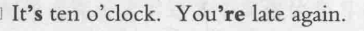
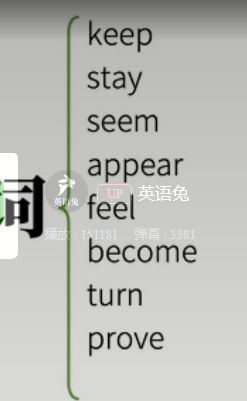

# 系动词 am is are


定义: 把系动词 后面的词赋值给前面的主语。

 i am a teacher 。

we are learning。

 i am not like math。

I am cold. Can you close the window, please?

we are learning。

第一称 用am

第三人称 用 is

第三人称 用 are   否定 + not


```
i am afraid of dogs
```



已经十点了，你们又迟到了。  late 晚  again 再一次

```
your keys are on the table
你的钥匙在桌子上。

i am tired . but i am not hungry.
```




这些都属于系动词。


The room remained empty。

房间一直是空的。


```
my  brother and  i am good tennis players.
players + s 表示某种类型的人。
```


疑问:
动词的复数的几种形式。代表什么意思。

介词 of 的作用

