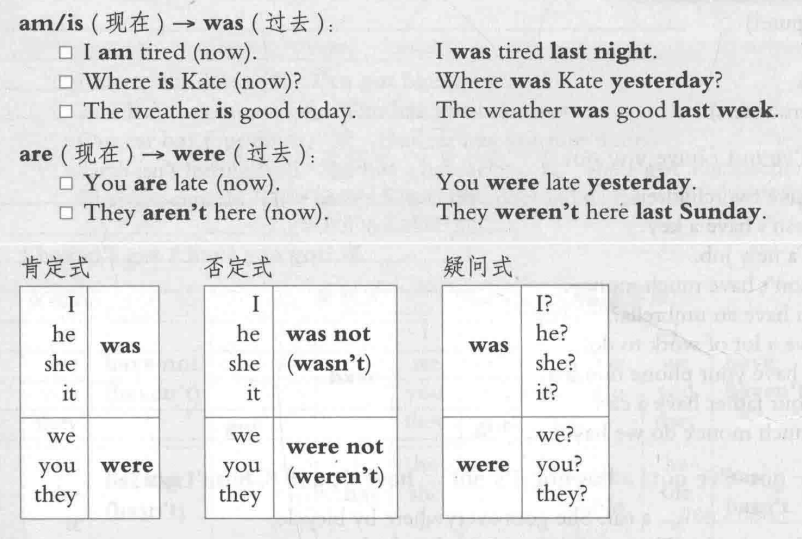

# was/were 过去式

与 现在进行时一样

is -- was

are -- were

## 含义

想表明的意思。  已经发生的事实。过去的发生的事情 比如当我什么的时候

不管是什么

1. 已经发生的事情
2. 事情结束了
3. 事实
4. 以前发生的事情

## 例子

### 1. 当我还是个孩子的时候，我很害怕狗。

when i was a child. i afriaed of a dogs

动词需要换成过去式。

### 2. 旅行结束后，我们都很饿，但是我们不累。我们非常开心。

### 3. 酒店很舒适，但是并不贵。

the hotel was comformtable. but it wasn’t expensive.

这里表示他们已经住下了，已经花钱买了。

### 4. 你放假的时候天气好吗？

Was the wearther nice when you were on holiday?

### 5. 今天早上你为什么会迟到?

why were you late this morning?

### 疑问句  他们没有再party上吗？ 对没有

Were they not at the party? no,  they weren’t

## 练习

### jack 和 tom昨天中午再一起吃饭。

 at Yesterday  Noon . jack and Tom had lunch together.

at Yesterday  Noon. i was readed english Grammar book.

### 我喜欢你这件新夹克。花了多少钱？

i like you the new jacket. Was it expensive?

### 

### 去年这个时候，我还在巴黎玩

this time last year i was played in paris.

### Were your exam diffcult ?

### Where sue and chris last week?

xx 和 xx 上周去哪了？ ther were on the holiday.

