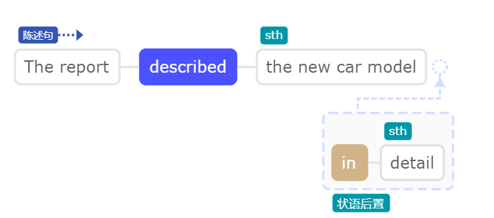
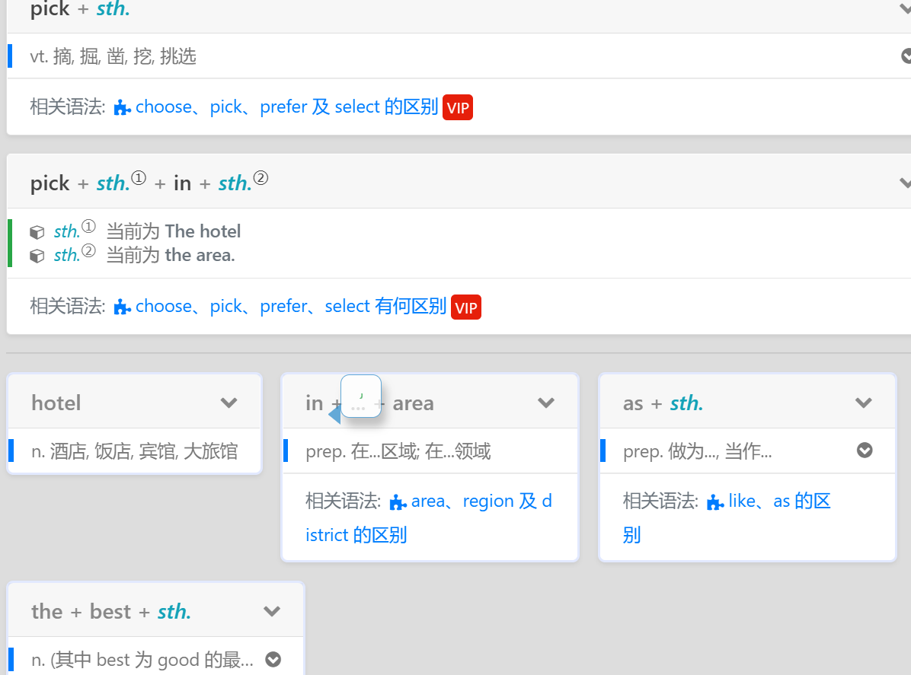
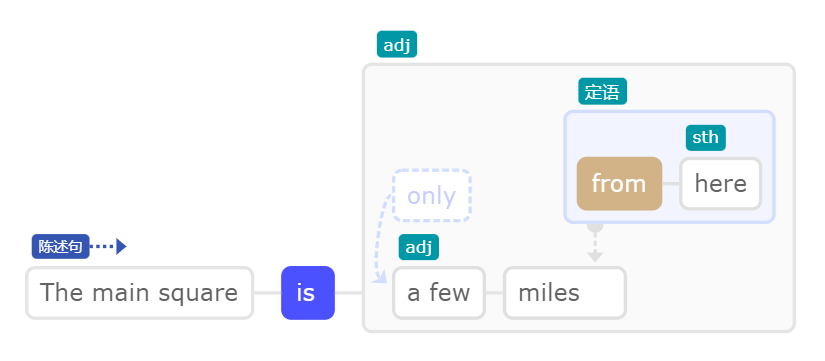

## You have a great music collection!

这种机会其实挺难得的。

## Thanks! – Don't mention it

## I would like to attend this meeting

### 1. would + like + to + *do.* + (*sth.*)

v. 想要...; 愿...

I would like to attend this meeting

## The car has a maximum speed of 200 km/h.

## We're going to need a bigger boat.

我们需要一艘更大的船。

## The report described the new car model in detail

## He just passed me on the street。

## May I bother you for a moment?

### 1. for a moment 片刻

## The report described the new car model in detail.

### in + detail

prep. 详细地

## I have made a series of phone calls to him

我已经打了好几个电话给他了

### a + series + of + *sth. *  一系列

n. 一系列..., 一批...

*sth.* 当前为 phone calls

### phone calls   电话

### have + *done.*  结束

v. 结束..., 做完...

## 3. The hotel was picked as the best one in the area.

这家酒店曾被当选为这片局域最好的酒店。

## The main square is only a few miles from here

### 1. main + square

n. (大)广场

### 2. from + here

prep. 从这里, 从当前处

### a + few

n. 几个, 少数, 一些

### only + a few

## 5. I received a grant to help pay for my studies

## 6. We have become closer over the years

### 1. over + ... + year(s)

prep. 在...年中, 在...年来, 经过...年之后; 最近...年

### 2. have + *done.*

v. 结束..., 做完...

### 3. become + *adj.*

v. 开始...; 变得...
