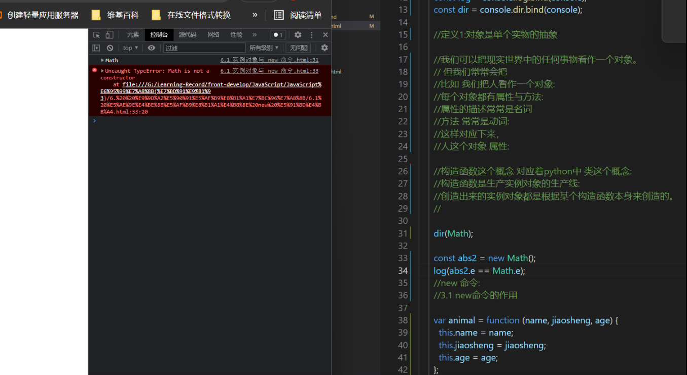

总结

实例对象 与new命令

需要回顾的。
1. 严格模式
2. `hasOwnProperty` 的作用
3. ​


尚未理解的知识点:



我创造了一个 Math的实例对象。

那么实例对象本身，继承了原型对象的属性与方法。

但输出的结果显示，Math 没有构造Constructor。

根据输出结果。大胆假设。

2.  使用new命令的原理，还是无法理解。

3.  ```javascript
    function _new(/* 构造函数 */ constructor, /* 构造函数参数 */ params) {
      // 将 arguments 对象转为数组
      var args = [].slice.call(arguments);
      // 取出构造函数
      var constructor = args.shift();
      // 创建一个空对象，继承构造函数的 prototype 属性
      var context = Object.create(constructor.prototype);
      // 执行构造函数
      var result = constructor.apply(context, args);
      // 如果返回结果是对象，就直接返回，否则返回 context 对象
      return (typeof result === 'object' && result != null) ? result : context;
    }

    // 实例
    var actor = _new(Person, '张三', 28);
    ```

这里又引出一个问题，当遇到难以理解的知识，而且是读了几遍都难以理解的知识。如何解决？

问题出在哪里？


闪念：
当一篇文章，小说，教科书，看过一遍之后。
回顾第二遍，第三遍时，我总会下意识地忽略我以为我懂了的知识点。但实际上，你无法确定你真的掌握了某个知识点，这样导致的后果就是，你会遗漏掉重点。

让我想起自学是门手艺中只字不差的阅读地能力。

结论:自学是门手艺中关于自学，学习的方法，对你学习肯定有帮助。


这将近两个小时，我没有敲代码？

疑问:


    对象是什么
    
    1. 在JavaScript中什么是对象。这个概念对应着 python中对象的概念吗？什么不是对象
    2. 与之类似的有哪些概念有哪些？
    
    
    1. 是什么？(内涵与外延)不是什么？
    对象是某一类似事物的抽象。把一类事物的共同特征抽象成类。
    我们把人抽象成一个类。
    抽象出来的事物还具有一些特征，而这些特征叫做 类的属性。
    与此同时，还会保留一些必要的行为，比如说话，思考。这叫做类型的方法。
    属性，一般是名词
    行为，一般用动词修饰。
    2. 
    
    
    
    
    
    
    
    
    构造函数
    new 命令
        基本用法
        new 命令的原理
        new.target
    Object.create() 创建实例对象


对象就是对应着类这个概念。


验收方法？

整理归纳总结。


用什么方式整理关键知识点？

知识（概念）整理组织归纳工具 ，列表，思维导图，图示，表格。

不在于形式，而在于开始行动。